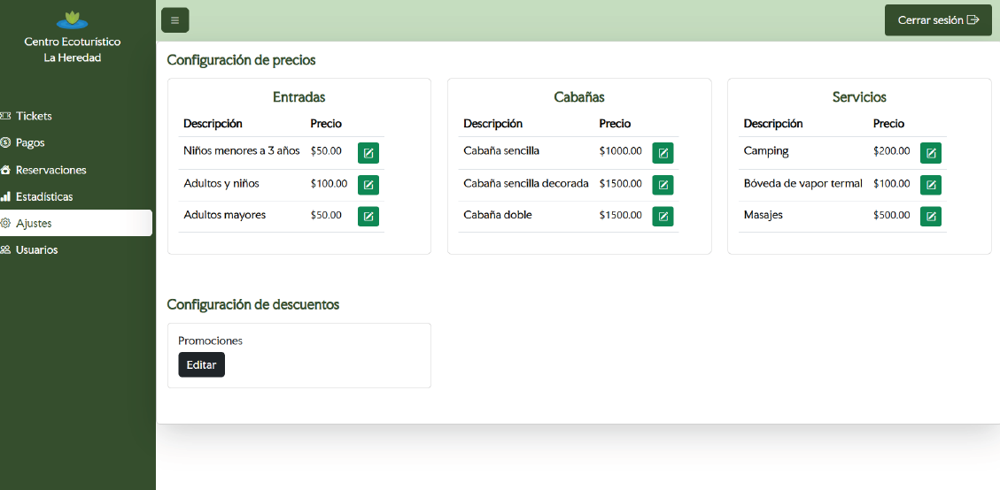

 <h1>🎟️ Ticket Control and Management System</h1>
  

    A comprehensive ticketing and service management platform developed for
    <strong>Centro Ecoturístico La Heredad</strong> in <strong>Ixmiquilpan, Hidalgo, Mexico</strong>.
    This project was led and developed by me to support local business modernization through digital transformation.
  

  <h2>🚀 Project Vision</h2>
  

    The initiative aimed to empower La Heredad with a scalable and secure system for managing services, processing payments,
    and improving customer engagement. It supports administrative efficiency and enhances client acquisition through technology.
  

  <h2>🛠️ Technologies Used</h2>
  <ul>
    <li><strong>Laravel</strong> – Backend framework for routing and business logic</li>
    <li><strong>MySQL</strong> – Relational database for structured data</li>
    <li><strong>Stripe API</strong> – Secure payment processing</li>
    <li><strong>JavaScript QR Libraries</strong> – Real-time ticket scanning and validation</li>
    <li><strong>Email Libraries</strong> – Automated email delivery with embedded QR codes</li>
  </ul>

  <h2>👤 Client Panel</h2>
  
This panel was designed to provide an intuitive and dynamic experience for visitors:

  <ul>
    <li>Display of available ecotourism services</li>
    <li>Updated pricing and tariffs</li>
    <li>Dynamic service request form tailored to client needs</li>
    <li>Secure payment integration via Stripe</li>
  </ul>

  <h3>📸 Client Panel Screenshots</h3>
  
  
  
  
  
  

  <h2>🛡️ Administrator Panel</h2>
  

    The admin panel was built to streamline internal operations and provide full control over service management:
  

  <ul>
    <li><strong>Tickets:</strong> View, validate, and scan QR codes</li>
    <li><strong>Payments:</strong> Monitor and verify transactions</li>
    <li><strong>Reservations:</strong> Manage service bookings and availability</li>
    <li><strong>Statistics:</strong> Visualize key metrics for decision-making</li>
    <li><strong>Settings:</strong> Configure services, pricing, and system parameters</li>
    <li><strong>Users:</strong> Manage roles, access levels, and administrative profiles</li>
  </ul>

  <h3>📸 Admin Panel Screenshots</h3>
  
  
  
  
  
  

  <h2>✉️ Email Confirmation & QR Integration</h2>
  

    Upon successful booking, clients receive automated emails containing:
  

  <ul>
    <li>Booking confirmation</li>
    <li>QR code ticket for scanning at the entrance</li>
  </ul>

  <h3>📸 Email Evidence</h3>
  
  

  <h2>🧠 Leadership & Development</h2>
  

    I led the full development lifecycle—from planning and architecture to deployment and testing.
    The system reflects best practices in security, modularity, and user experience, with seamless integration of third-party APIs and real-time data handling.
  

  <h2>📌 Impact for La Heredad</h2>
  
Thanks to this system, the ecotourism center now benefits from:

  <ul>
    <li>Streamlined customer service and ticketing</li>
    <li>Automated payment and reservation workflows</li>
    <li>Enhanced operational control and data visibility</li>
    <li>A solid foundation for future digital expansion</li>
  </ul>

## About Laravel

Laravel is a web application framework with expressive, elegant syntax. We believe development must be an enjoyable and creative experience to be truly fulfilling. Laravel takes the pain out of development by easing common tasks used in many web projects, such as:

- [Simple, fast routing engine](https://laravel.com/docs/routing).
- [Powerful dependency injection container](https://laravel.com/docs/container).
- Multiple back-ends for [session](https://laravel.com/docs/session) and [cache](https://laravel.com/docs/cache) storage.
- Expressive, intuitive [database ORM](https://laravel.com/docs/eloquent).
- Database agnostic [schema migrations](https://laravel.com/docs/migrations).
- [Robust background job processing](https://laravel.com/docs/queues).
- [Real-time event broadcasting](https://laravel.com/docs/broadcasting).

Laravel is accessible, powerful, and provides tools required for large, robust applications.

## Learning Laravel

Laravel has the most extensive and thorough [documentation](https://laravel.com/docs) and video tutorial library of all modern web application frameworks, making it a breeze to get started with the framework.

You may also try the [Laravel Bootcamp](https://bootcamp.laravel.com), where you will be guided through building a modern Laravel application from scratch.

If you don't feel like reading, [Laracasts](https://laracasts.com) can help. Laracasts contains thousands of video tutorials on a range of topics including Laravel, modern PHP, unit testing, and JavaScript. Boost your skills by digging into our comprehensive video library.

## Laravel Sponsors

We would like to extend our thanks to the following sponsors for funding Laravel development. If you are interested in becoming a sponsor, please visit the [Laravel Partners program](https://partners.laravel.com).

### Premium Partners

- **[Vehikl](https://vehikl.com/)**
- **[Tighten Co.](https://tighten.co)**
- **[WebReinvent](https://webreinvent.com/)**
- **[Kirschbaum Development Group](https://kirschbaumdevelopment.com)**
- **[64 Robots](https://64robots.com)**
- **[Curotec](https://www.curotec.com/services/technologies/laravel/)**
- **[Cyber-Duck](https://cyber-duck.co.uk)**
- **[DevSquad](https://devsquad.com/hire-laravel-developers)**
- **[Jump24](https://jump24.co.uk)**
- **[Redberry](https://redberry.international/laravel/)**
- **[Active Logic](https://activelogic.com)**
- **[byte5](https://byte5.de)**
- **[OP.GG](https://op.gg)**

## Contributing

Thank you for considering contributing to the Laravel framework! The contribution guide can be found in the [Laravel documentation](https://laravel.com/docs/contributions).

## Code of Conduct

In order to ensure that the Laravel community is welcoming to all, please review and abide by the [Code of Conduct](https://laravel.com/docs/contributions#code-of-conduct).

## Security Vulnerabilities

If you discover a security vulnerability within Laravel, please send an e-mail to Taylor Otwell via [taylor@laravel.com](mailto:taylor@laravel.com). All security vulnerabilities will be promptly addressed.

## License

The Laravel framework is open-sourced software licensed under the [MIT license](https://opensource.org/licenses/MIT).
